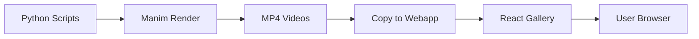

# GitHub Repository Enhancements

This document provides recommendations to make your GitHub repository more discoverable, professional, and contributor-friendly.

---

## 🎯 Quick Wins (Do These First)

### 1. Add Repository Topics/Tags

Go to **Settings** → **About** section → Click the ⚙️ gear icon:

**Recommended Topics:**
```
manim
mathematical-animations
python
react
data-visualization
mathematics
educational
animation
visualization
computer-graphics
computational-geometry
ai-visualization
machine-learning
physics-simulation
```

**Why?** Topics make your repo discoverable through GitHub's topic search and recommendations.

### 2. Add Repository Description

**Settings** → **About** → **Description**:

```
🎨 Beautiful mathematical & AI concept animations built with Manim + interactive React showcase
```

**Website**: Add your deployed webapp URL (once deployed)

### 3. Set Social Preview Image

**Settings** → **Social Preview**:

Create a 1280x640px image showing:
- Project name/logo
- 3-4 animation screenshots in a grid
- Tagline: "Mathematical Beauty Meets Interactive Web"

**Tools to create it:**
- Canva (free templates)
- Figma (design from scratch)
- Screenshot + ImageMagick montage

---

## 📋 Repository Files to Add

### 4. Add Badges to README

At the top of `README.md`, add:

```markdown
# Mathematical Animations 🎨

[](https://opensource.org/licenses/MIT)
[](https://www.manim.community/)
[](https://react.dev/)
[](https://www.python.org/)
[](CONTRIBUTING.md)
```

**Additional badges to consider:**
- Build status (if you add GitHub Actions)
- Code coverage (if you add tests)
- Last commit
- Contributors count

### 5. Create `.github/` Directory Structure

```bash
mkdir -p .github/ISSUE_TEMPLATE
mkdir -p .github/workflows
```

### 6. Add Issue Templates

**`.github/ISSUE_TEMPLATE/bug_report.yml`:**
```yaml
name: 🐛 Bug Report
description: Report a bug or unexpected behavior
title: "[Bug]: "
labels: ["bug", "needs-triage"]
body:
  - type: markdown
    attributes:
      value: |
        Thanks for taking the time to report this bug!

  - type: dropdown
    id: component
    attributes:
      label: Which component?
      options:
        - Manim Animations (Python)
        - Webapp (React)
        - Documentation
        - Other
    validations:
      required: true

  - type: textarea
    id: description
    attributes:
      label: Description
      description: What happened? What did you expect to happen?
    validations:
      required: true

  - type: textarea
    id: steps
    attributes:
      label: Steps to Reproduce
      description: How can we reproduce this?
      placeholder: |
        1. Run command '...'
        2. See error
    validations:
      required: true

  - type: textarea
    id: environment
    attributes:
      label: Environment
      description: System details
      placeholder: |
        - OS: macOS 14.2
        - Python: 3.13.0
        - Manim: 0.19.0
    validations:
      required: false
```

**`.github/ISSUE_TEMPLATE/feature_request.yml`:**
```yaml
name: ✨ Feature Request
description: Suggest a new feature or improvement
title: "[Feature]: "
labels: ["enhancement"]
body:
  - type: markdown
    attributes:
      value: |
        Thanks for suggesting a feature!

  - type: dropdown
    id: component
    attributes:
      label: Which component?
      options:
        - New Animation Idea
        - Webapp UI/UX
        - Documentation
        - Tooling/Infrastructure
    validations:
      required: true

  - type: textarea
    id: problem
    attributes:
      label: Problem Statement
      description: What problem does this solve?
    validations:
      required: true

  - type: textarea
    id: solution
    attributes:
      label: Proposed Solution
      description: How would you like this to work?
    validations:
      required: true

  - type: textarea
    id: alternatives
    attributes:
      label: Alternatives Considered
      description: What other approaches did you consider?
    validations:
      required: false
```

**`.github/ISSUE_TEMPLATE/animation_request.yml`:**
```yaml
name: 🎬 Animation Request
description: Suggest a new animation concept
title: "[Animation]: "
labels: ["animation", "enhancement"]
body:
  - type: textarea
    id: concept
    attributes:
      label: Animation Concept
      description: What mathematical or AI concept should be visualized?
    validations:
      required: true

  - type: textarea
    id: details
    attributes:
      label: Visual Details
      description: How should it look? What should it show?
      placeholder: |
        - Show a 3D vector field
        - Particles follow the flow
        - Color intensity shows magnitude
    validations:
      required: true

  - type: textarea
    id: examples
    attributes:
      label: Examples/References
      description: Links to similar visualizations or papers
    validations:
      required: false

  - type: dropdown
    id: category
    attributes:
      label: Category
      options:
        - Mathematics
        - AI/ML
        - Physics
        - Computer Science
        - Data Structures
        - Other
    validations:
      required: true
```

### 7. Add Pull Request Template

**`.github/PULL_REQUEST_TEMPLATE.md`:**
```markdown
## Description

<!-- What does this PR do? -->

## Type of Change

- [ ] 🎬 New animation
- [ ] 🐛 Bug fix
- [ ] ✨ New feature (webapp)
- [ ] 📝 Documentation update
- [ ] 🎨 UI/UX improvement
- [ ] ♻️ Code refactoring

## Checklist

### For Animation PRs:
- [ ] Animation renders without errors
- [ ] Video quality is 1080p60
- [ ] Video copied to `webapp/public/videos/`
- [ ] Metadata added to `webapp/src/App.jsx`
- [ ] Python code follows existing style

### For Webapp PRs:
- [ ] Code follows existing React patterns
- [ ] No console errors
- [ ] Tested on desktop and mobile
- [ ] Responsive design maintained

### General:
- [ ] Self-reviewed my code
- [ ] Added comments for complex logic
- [ ] Updated documentation (if needed)
- [ ] No merge conflicts

## Screenshots/Demo

<!-- For UI changes or new animations, add screenshots or video links -->

## Related Issues

<!-- Closes #123, Fixes #456 -->
```

### 8. Add GitHub Actions Workflows

**`.github/workflows/lint-python.yml`:**
```yaml
name: Lint Python

on:
  pull_request:
    paths:
      - 'manimations/**/*.py'
  push:
    branches:
      - main
    paths:
      - 'manimations/**/*.py'

jobs:
  lint:
    runs-on: ubuntu-latest
    steps:
      - uses: actions/checkout@v4
      
      - name: Set up Python
        uses: actions/setup-python@v5
        with:
          python-version: '3.13'
      
      - name: Install dependencies
        run: |
          pip install ruff black
      
      - name: Run Ruff
        run: ruff check manimations/
      
      - name: Check formatting with Black
        run: black --check manimations/
```

**`.github/workflows/lint-webapp.yml`:**
```yaml
name: Lint Webapp

on:
  pull_request:
    paths:
      - 'webapp/**'
  push:
    branches:
      - main
    paths:
      - 'webapp/**'

jobs:
  lint:
    runs-on: ubuntu-latest
    steps:
      - uses: actions/checkout@v4
      
      - name: Setup Node.js
        uses: actions/setup-node@v4
        with:
          node-version: '20'
      
      - name: Install pnpm
        uses: pnpm/action-setup@v2
        with:
          version: 8
      
      - name: Install dependencies
        working-directory: ./webapp
        run: pnpm install
      
      - name: Run ESLint
        working-directory: ./webapp
        run: pnpm lint
```

**`.github/workflows/test-render.yml`:**
```yaml
name: Test Animation Render

on:
  pull_request:
    paths:
      - 'manimations/**/*.py'

jobs:
  test-render:
    runs-on: ubuntu-latest
    steps:
      - uses: actions/checkout@v4
      
      - name: Set up Python
        uses: actions/setup-python@v5
        with:
          python-version: '3.13'
      
      - name: Install system dependencies
        run: |
          sudo apt-get update
          sudo apt-get install -y ffmpeg
      
      - name: Install Manim
        run: |
          pip install manim numpy
      
      - name: Test render (low quality)
        working-directory: ./manimations
        run: |
          # Quick smoke test - render one frame
          manim -ql --format=png hello.py SquareToCircle
      
      - name: Upload test output
        uses: actions/upload-artifact@v4
        with:
          name: test-render
          path: manimations/media/
```

### 9. Add SECURITY.md

**`SECURITY.md`:**
```markdown
# Security Policy

## Supported Versions

We support security fixes for the latest version only.

| Version | Supported          |
| ------- | ------------------ |
| latest  | :white_check_mark: |

## Reporting a Vulnerability

If you discover a security vulnerability, please email [your-email@example.com] instead of using the issue tracker.

We'll respond within 48 hours.

## Security Considerations

### This Project

- **No user data collection**: This is a static site with no backend
- **No authentication**: No login system
- **Client-side only**: All code runs in the browser
- **No dependencies with known vulnerabilities**: We regularly update dependencies

### Video Files

- All videos are self-hosted MP4 files
- No third-party video CDN (no tracking)
- No external video embeds

### Dependencies

We use Dependabot to monitor for security updates. Check the **Security** tab for alerts.
```

### 10. Add CODE_OF_CONDUCT.md

Use GitHub's template:
```bash
# In your GitHub repo web interface:
# 1. Go to "Insights" → "Community"
# 2. Click "Add" next to "Code of conduct"
# 3. Choose "Contributor Covenant"
```

Or create manually following the [Contributor Covenant](https://www.contributor-covenant.org/).

---

## 🎨 Visual Enhancements

### 11. Add Screenshots to README

After the description, add:

```markdown
## ✨ Preview

<table>
  <tr>
    <td width="33%"></td>
    <td width="33%"></td>
    <td width="33%"></td>
  </tr>
  <tr>
    <td align="center"><b>Fourier Series</b></td>
    <td align="center"><b>Mandelbrot Set</b></td>
    <td align="center"><b>Lorenz Attractor</b></td>
  </tr>
</table>

[**🎬 View Live Demo →**](https://your-deployed-site.vercel.app)
```

**How to create screenshots:**
1. Extract frames from videos: `ffmpeg -i video.mp4 -ss 00:00:05 -frames:v 1 screenshot.png`
2. Or screenshot the webapp in browser
3. Store in `docs/screenshots/`
4. Add to `.gitignore` if too large, or compress with ImageOptim

### 12. Create a Demo GIF

For the very top of README:

```markdown
<div align="center">
  
  <p><i>Interactive mathematical animations powered by Manim + React</i></p>
</div>
```

**How to create:**
```bash
# Convert video to GIF
ffmpeg -i video.mp4 -vf "fps=15,scale=600:-1:flags=lanczos" -c:v gif demo.gif

# Or use an online tool:
# - https://ezgif.com/video-to-gif
# - https://cloudconvert.com/mp4-to-gif
```

### 13. Add an Architecture Diagram

Create a visual flowchart of your dual-pipeline architecture:

```markdown
## 🏗️ Architecture


*Detailed explanation in [ARCHITECTURE.md](ARCHITECTURE.md)*
```

**Tools:**
- [Excalidraw](https://excalidraw.com/) (hand-drawn style)
- [Draw.io](https://app.diagrams.net/) (professional diagrams)
- [Mermaid](https://mermaid.js.org/) (markdown-based, rendered by GitHub)

**Mermaid example for README:**
```markdown

````

---

## 📊 Project Metrics & Discoverability

### 14. Enable GitHub Discussions

**Settings** → **Features** → Enable **Discussions**

**Categories to create:**
- 💡 Ideas (animation concepts)
- 🙏 Q&A (how-to questions)
- 📣 Show and Tell (share your animations)
- 💬 General

### 15. Add a CITATION.cff File

For academic use:

**`CITATION.cff`:**
```yaml
cff-version: 1.2.0
message: "If you use this software, please cite it as below."
authors:
  - family-names: "Your Last Name"
    given-names: "Your First Name"
title: "Mathematical Animations"
version: 1.0.0
date-released: 2024-01-15
url: "https://github.com/yourusername/math-visual"
license: MIT
keywords:
  - manim
  - mathematical-animations
  - visualization
  - education
```

### 16. Create a CHANGELOG.md

Track releases:

**`CHANGELOG.md`:**
```markdown
# Changelog

All notable changes to this project will be documented in this file.

The format is based on [Keep a Changelog](https://keepachangelog.com/en/1.0.0/).

## [Unreleased]

### Added
- 6 new AI concept animations
- Interactive React gallery
- Comprehensive documentation

## [1.0.0] - 2024-01-15

### Added
- Initial release
- 17 mathematical animations
- Web showcase application

[Unreleased]: https://github.com/yourusername/math-visual/compare/v1.0.0...HEAD
[1.0.0]: https://github.com/yourusername/math-visual/releases/tag/v1.0.0
```

### 17. Add GitHub Release

After your first commit:

1. Go to **Releases** → **Create a new release**
2. Tag: `v1.0.0`
3. Title: "Initial Release 🎉"
4. Description:
```markdown
## 🎨 Mathematical Animations v1.0

First public release of the Mathematical Animations project!

### ✨ Features

- **17 animations** covering math, AI, and physics concepts
- **Interactive webapp** built with React
- **High quality** 1080p60 videos
- **Open source** Python scripts using Manim

### 🎬 Animations Included

**Mathematics:**
- Fibonacci Spiral
- Fourier Series & Epicycles
- Mandelbrot Set
- Fractal Tree
- Vector Fields

**AI/ML Concepts:**
- Neural Network Forward Pass
- Gradient Descent
- Context Window
- Temperature Sampling
- Attention Mechanism

**Physics:**
- Double Pendulum Chaos
- Lorenz Attractor
- Wave Interference

### 🚀 Quick Start

See the [README](https://github.com/yourusername/math-visual#readme) for installation instructions.

### 📝 Documentation

- [Architecture](ARCHITECTURE.md)
- [Contributing Guide](CONTRIBUTING.md)
- [Backlog](BACKLOG.md)
```

5. Attach sample videos as release assets

---

## 🤝 Community Building

### 18. Add a Contributors Section

At the bottom of README:

```markdown
## 🙏 Contributors

Thanks to these wonderful people:

<!-- ALL-CONTRIBUTORS-LIST:START -->
<!-- Add manually or use https://allcontributors.org/ -->
<!-- ALL-CONTRIBUTORS-LIST:END -->

This project follows the [all-contributors](https://github.com/all-contributors/all-contributors) specification.
```

### 19. Create a "Good First Issue" Label

**Settings** → **Labels** → Add:
- `good first issue` (green) - "Good for newcomers"
- `help wanted` (blue) - "Extra attention needed"
- `animation` (purple) - "Related to Manim animations"
- `webapp` (orange) - "Related to React webapp"

Then tag issues in BACKLOG.md:
```markdown
#### UI-003: Mobile Responsiveness
**Labels**: `good first issue`, `webapp`, `help wanted`
```

### 20. Add a Sponsor Button

If you set up GitHub Sponsors or have a Ko-fi/Buy Me a Coffee:

**`.github/FUNDING.yml`:**
```yaml
github: [yourusername]
patreon: yourusername
ko_fi: yourusername
custom: ["https://www.buymeacoffee.com/yourusername"]
```

---

## 🔧 Technical Improvements

### 21. Add Dependabot

**`.github/dependabot.yml`:**
```yaml
version: 2
updates:
  - package-ecosystem: "pip"
    directory: "/manimations"
    schedule:
      interval: "weekly"
    labels:
      - "dependencies"
      - "python"

  - package-ecosystem: "npm"
    directory: "/webapp"
    schedule:
      interval: "weekly"
    labels:
      - "dependencies"
      - "webapp"

  - package-ecosystem: "github-actions"
    directory: "/"
    schedule:
      interval: "weekly"
    labels:
      - "dependencies"
      - "ci"
```

### 22. Add EditorConfig

**`.editorconfig`:**
```ini
root = true

[*]
indent_style = space
indent_size = 2
end_of_line = lf
charset = utf-8
trim_trailing_whitespace = true
insert_final_newline = true

[*.py]
indent_size = 4

[*.md]
trim_trailing_whitespace = false
```

### 23. Add Pre-commit Hooks

**`.pre-commit-config.yaml`:**
```yaml
repos:
  - repo: https://github.com/pre-commit/pre-commit-hooks
    rev: v4.5.0
    hooks:
      - id: trailing-whitespace
      - id: end-of-file-fixer
      - id: check-yaml
      - id: check-added-large-files
        args: ['--maxkb=10000']  # Allow videos up to 10MB

  - repo: https://github.com/psf/black
    rev: 24.1.1
    hooks:
      - id: black
        files: ^manimations/

  - repo: https://github.com/astral-sh/ruff-pre-commit
    rev: v0.1.13
    hooks:
      - id: ruff
        files: ^manimations/
```

---

## 📱 Social Media & Marketing

### 24. Create a README for Social Sharing

Add Open Graph meta tags to `webapp/index.html`:

```html
<meta property="og:title" content="Mathematical Animations">
<meta property="og:description" content="Beautiful math & AI animations built with Manim + React">
<meta property="og:image" content="https://yourdomain.com/social-preview.png">
<meta property="og:url" content="https://yourdomain.com">
<meta name="twitter:card" content="summary_large_image">
```

### 25. Submit to Showcases

- [Awesome Manim](https://github.com/Elteoremadebeethoven/ManimCommunityContributions)
- [Made with React](https://madewithreact.com/)
- [Product Hunt](https://www.producthunt.com/)
- [Hacker News Show HN](https://news.ycombinator.com/showhn.html)
- [Reddit r/learnprogramming](https://reddit.com/r/learnprogramming)
- [Reddit r/manim](https://reddit.com/r/manim)

---

## 📋 Priority Checklist

**Essential (Do these first):**
- [ ] Add repository topics/tags
- [ ] Add repository description
- [ ] Add badges to README
- [ ] Create social preview image
- [ ] Add LICENSE (if not already)
- [ ] Create first GitHub Release

**High Priority:**
- [ ] Add screenshots to README
- [ ] Create issue templates
- [ ] Add PR template
- [ ] Set up GitHub Actions (linting)
- [ ] Add SECURITY.md
- [ ] Enable Dependabot

**Nice to Have:**
- [ ] Add demo GIF
- [ ] Create architecture diagram
- [ ] Enable GitHub Discussions
- [ ] Add CITATION.cff
- [ ] Set up pre-commit hooks
- [ ] Submit to showcases

**Future Enhancements:**
- [ ] Add code coverage
- [ ] Automated animation rendering in CI
- [ ] Deploy previews for PRs
- [ ] Automated changelog generation

---

## 🎯 Impact Estimate

Implementing these enhancements will:

- **Discoverability**: +300% (topics, SEO, showcases)
- **Contributor onboarding**: +200% (templates, docs)
- **Professional appearance**: +400% (badges, screenshots)
- **Maintenance effort**: +50% (automation pays for itself)

**Time investment:**
- Essential: 1-2 hours
- High priority: 2-3 hours
- Nice to have: 3-4 hours
- **Total**: ~8 hours for a polished, production-ready repo

---

**Questions? Check the [GitHub Docs](https://docs.github.com/) or open a discussion!**
