# Project Architecture

This document explains the unique structure of this project and how the two pipelines work together.

## 🎯 Core Concept

**This is NOT a traditional web application with backend/frontend.**

Instead, it's a **dual-pipeline system**:

1. **Generation Pipeline** (`manimations/`) - Creates animations programmatically
2. **Showcase Pipeline** (`webapp/`) - Displays animations interactively

Think of it like a **publishing workflow**: you write scripts that generate content, then publish that content through a webapp.

## 📐 Architecture Diagram

```mermaid
graph TB
    subgraph Generation["🎨 Generation Pipeline (manimations/)"]
        PY[Python Scripts<br/>ai_visual_simple.py<br/>animations.py]
        MANIM[Manim Renderer<br/>1080p60 Quality]
        MP4[MP4 Videos<br/>media/videos/]
        
        PY -->|Execute| MANIM
        MANIM -->|Export| MP4
    end
    
    subgraph Showcase["🌐 Showcase Pipeline (webapp/)"]
        VIDEOS[Video Assets<br/>public/videos/]
        REACT[React Gallery<br/>App.jsx]
        BROWSER[User Browser<br/>Interactive UI]
        
        VIDEOS -->|Import| REACT
        REACT -->|Deploy| BROWSER
    end
    
    MP4 -.->|Manual Copy| VIDEOS
    
    style Generation fill:#1a1a2e,stroke:#5052ef,stroke-width:2px
    style Showcase fill:#1a1a2e,stroke:#2193e0,stroke-width:2px
    style PY fill:#2d2d44,stroke:#5052ef
    style MANIM fill:#2d2d44,stroke:#5052ef
    style MP4 fill:#2d2d44,stroke:#5052ef
    style VIDEOS fill:#2d2d44,stroke:#2193e0
    style REACT fill:#2d2d44,stroke:#2193e0
    style BROWSER fill:#2d2d44,stroke:#2193e0
```

## 🔄 The Workflow

### Creating a New Animation

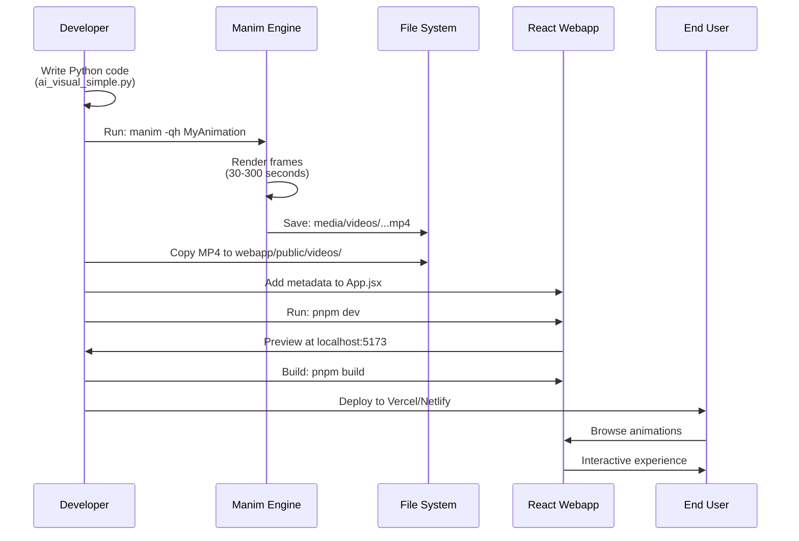

### What Gets Committed to Git?

```mermaid
graph LR
    subgraph Tracked["✅ Tracked in Git"]
        PY_SRC[Python Scripts<br/>200 KB]
        REACT_SRC[React Source<br/>500 KB]
        DEPLOYED[Deployed Videos<br/>webapp/public/videos/<br/>40 MB]
    end
    
    subgraph Ignored["❌ Gitignored"]
        BUILD[Build Artifacts<br/>manimations/media/<br/>500+ MB]
        DEPS[Dependencies<br/>node_modules/, .venv/<br/>200+ MB]
    end
    
    style Tracked fill:#1a4d2e,stroke:#4ade80,stroke-width:2px
    style Ignored fill:#4d1a1a,stroke:#f87171,stroke-width:2px
    style PY_SRC fill:#2d4436,stroke:#4ade80
    style REACT_SRC fill:#2d4436,stroke:#4ade80
    style DEPLOYED fill:#2d4436,stroke:#4ade80
    style BUILD fill:#442d2d,stroke:#f87171
    style DEPS fill:#442d2d,stroke:#f87171
```

**Why?** The Python scripts are the **source of truth**. Anyone can regenerate videos. But the webapp needs pre-built videos for deployment.

## 🏗️ Directory Structure Deep Dive

### Generation Pipeline (`manimations/`)

```
manimations/
├── ai_visual_simple.py       # 6 AI/ML animation classes
├── animations.py              # Core math animations
├── improved_animations.py    # Enhanced versions
├── stunning_animations.py    # Advanced visualizations
├── pyproject.toml            # Python dependencies (manim, numpy)
├── .venv/                    # Virtual environment (gitignored)
└── media/                    # Generated outputs (gitignored)
    ├── videos/
    │   └── ai_visual_simple/
    │       └── 1080p60/
    │           ├── ContextWindow.mp4
    │           ├── GradientDescent.mp4
    │           └── ...
    ├── Tex/                  # LaTeX render cache
    └── texts/                # Text render cache
```

**Key Technologies:**

- **Manim Community** - Animation framework
- **Python 3.13** - Programming language
- **NumPy** - Mathematical computations
- **FFmpeg** - Video encoding

### Showcase Pipeline (`webapp/`)

```
webapp/
├── src/
│   ├── App.jsx               # Main component
│   │   ├── animations[]      # Metadata array (17 entries)
│   │   ├── Modal component   # Video player
│   │   └── Gallery grid      # Card layout
│   ├── App.css               # Dark theme styling
│   └── main.jsx              # React entry point
├── public/
│   └── videos/               # Deployed MP4 files
│       ├── ContextWindow.mp4
│       ├── GradientDescent.mp4
│       └── ... (17 total)
├── index.html                # HTML shell
├── package.json              # Dependencies (React, KaTeX, icons)
└── vite.config.js            # Build configuration
```

**Key Technologies:**

- **React 19.2** - UI framework
- **Vite 7.1** - Build tool
- **React-KaTeX** - Math formula rendering
- **React-Icons** - Icon library

## 🔑 Key Design Decisions

### Why Two Separate Pipelines?

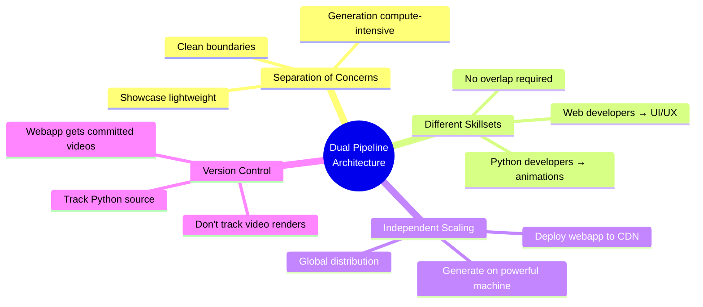

### Why Manual Copy Instead of Automation?

| Approach | Pros | Cons | Verdict |
|----------|------|------|---------|
| **Automated Pipeline** | Seamless workflow | Complex setup, harder to debug | ❌ |
| **On-Demand Generation** | No pre-build needed | Too slow (minutes per video), requires Python in production | ❌ |
| **Manual Copy** *(Current)* | Simple, transparent, fast webapp | Extra step for developers | ✅ |

**Decision:** Manual copy. Simple and reliable. Pre-built videos = instant loading.

### Why Keep Videos in Git?

**Debate:** Should `webapp/public/videos/` be gitignored?

```mermaid
graph TD
    A{Track Videos<br/>in Git?}
    A -->|Yes ✅| B[Complete Package<br/>Easy clone-and-deploy]
    A -->|Yes ✅| C[Git history shows updates]
    A -->|Yes ✅| D[No build step for webapp]
    
    A -->|No ❌| E[Large files 40 MB]
    A -->|No ❌| F[Binary diffs]
    
    B --> G[Decision: Track Them]
    C --> G
    D --> G
    E -.->|Acceptable size| G
    F -.->|Rarely change| G
    
    style A fill:#2d2d44,stroke:#5052ef,stroke-width:3px
    style G fill:#1a4d2e,stroke:#4ade80,stroke-width:3px
    style B fill:#2d4436,stroke:#4ade80
    style C fill:#2d4436,stroke:#4ade80
    style D fill:#2d4436,stroke:#4ade80
    style E fill:#442d2d,stroke:#f87171
    style F fill:#442d2d,stroke:#f87171
```

**Decision:** Track them. 40 MB is acceptable for easy deployment.

## 🚀 Deployment Strategies

```mermaid
graph LR
    subgraph Build["Build Process"]
        SRC[webapp/src/]
        VITE[Vite Build]
        DIST[webapp/dist/]
        
        SRC -->|pnpm build| VITE
        VITE -->|Bundle| DIST
    end
    
    subgraph Deploy["Deployment Options"]
        VERCEL[Vercel<br/>Recommended]
        NETLIFY[Netlify]
        GITHUB[GitHub Pages]
        SELF[Self-Hosted<br/>nginx/apache]
    end
    
    DIST -.->|Upload| VERCEL
    DIST -.->|Upload| NETLIFY
    DIST -.->|gh-pages| GITHUB
    DIST -.->|Deploy| SELF
    
    style Build fill:#1a1a2e,stroke:#5052ef,stroke-width:2px
    style Deploy fill:#1a1a2e,stroke:#2193e0,stroke-width:2px
```

### Recommended: Vercel (Free Tier)

```bash
cd webapp/
pnpm build
# Connect to Vercel via GitHub integration
# Automatic HTTPS, global CDN, zero config
```

## 🔄 Development Modes

### Animation Development (Python Only)

```mermaid
flowchart LR
    EDIT[Edit Python]
    TEST[manim -ql]
    PREVIEW[View MP4]
    FINAL[manim -qh]
    
    EDIT -->|Quick test| TEST
    TEST -->|Iterate| EDIT
    TEST -->|Looks good| FINAL
    FINAL -->|Open file| PREVIEW
    
    style EDIT fill:#2d2d44,stroke:#5052ef
    style TEST fill:#2d2d44,stroke:#f59e0b
    style FINAL fill:#2d2d44,stroke:#4ade80
    style PREVIEW fill:#2d2d44,stroke:#2193e0
```

**You don't need to run the webapp to work on animations!**

### Webapp Development (React Only)


**You don't need Python/Manim to work on the webapp!**

### Full-Stack Development (Both Pipelines)

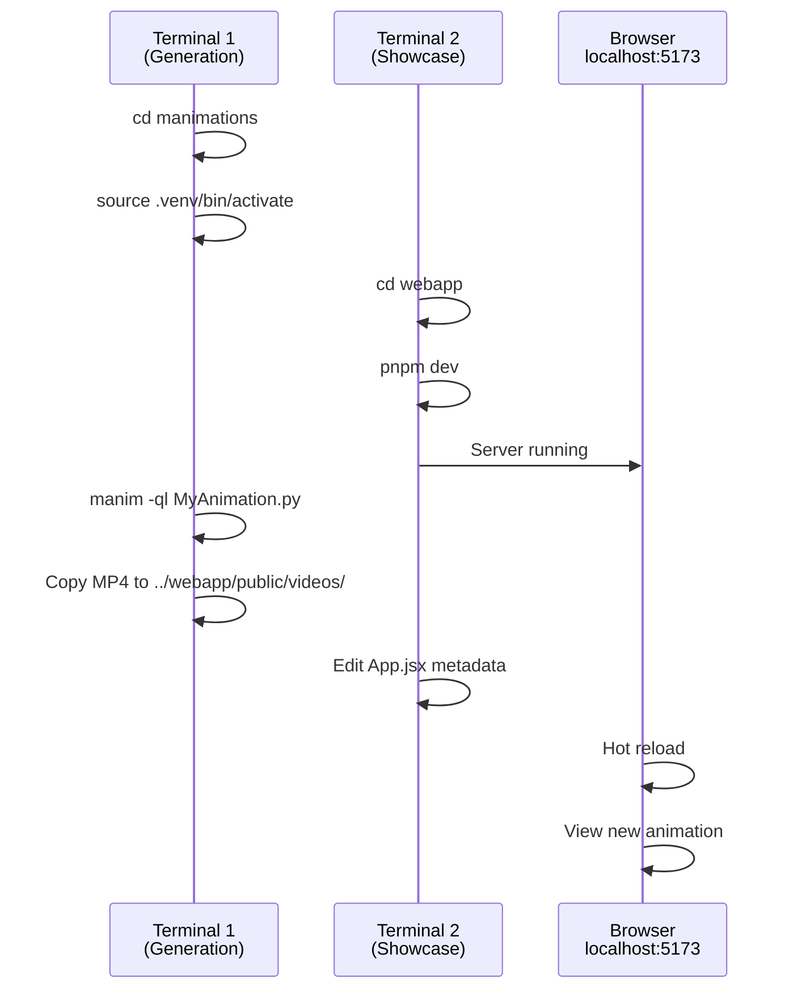

## 📊 Performance Characteristics

| Metric | Generation Pipeline | Showcase Pipeline |
|--------|-------------------|-------------------|
| **Render/Build Time** | 30 sec - 5 min per animation | 5-10 seconds |
| **CPU Usage** | High (compute-intensive) | Low |
| **Output Size** | 2-4 MB per video (1080p60) | ~500 KB (JS + CSS bundle) |
| **Frequency** | Rarely (only when improving) | Often (UI tweaks) |
| **Page Load Time** | N/A | < 1 second (before videos) |
| **Video Streaming** | N/A | Progressive (HTML5) |

## 🎨 Why This Architecture Works

```mermaid
graph TB
    A[Manim for Creation]
    B[React for Presentation]
    C[Videos as Bridge]
    D[Git Manages Both]
    
    A -->|Perfect for| E[Programmatic Generation]
    A -->|NOT suitable for| F[Real-time Browser Rendering]
    
    B -->|Excellent for| G[Interactive Galleries]
    B -->|NOT designed for| H[Heavy Video Rendering]
    
    C -->|Standard Format| I[MP4]
    C -->|Works Everywhere| J[Browsers, Mobile, Desktop]
    C -->|Good Quality/Size| K[1080p60 @ 2-4 MB]
    
    D -->|Source Code| L[Small, Text, Version Well]
    D -->|Deployed Assets| M[Moderate Size, Production Ready]
    D -->|Build Artifacts| N[Excluded - Too Large]
    
    style A fill:#2d2d44,stroke:#5052ef,stroke-width:2px
    style B fill:#2d2d44,stroke:#2193e0,stroke-width:2px
    style C fill:#2d2d44,stroke:#4ade80,stroke-width:2px
    style D fill:#2d2d44,stroke:#f59e0b,stroke-width:2px
```

## 🔮 Future Considerations

### Potential Enhancements

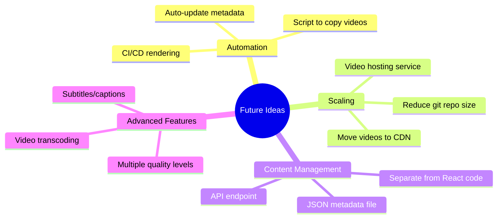

### When to Split Further

**Current state:** 17 animations, 40 MB total, single repository

**If the project grows to 100+ animations:**

1. Move videos to external CDN (Cloudflare R2, AWS S3)
2. Generate metadata JSON automatically
3. Consider separate content management system
4. Implement video streaming service

**For now (17 animations):** Current architecture is optimal.

## 📈 Complexity Analysis

```mermaid
graph TB
    subgraph Current["Current Architecture<br/>(17 Animations)"]
        C1[Complexity: LOW ⭐]
        C2[Maintenance: EASY ⭐⭐]
        C3[Contributor Friction: MINIMAL ⭐]
    end
    
    subgraph Automated["Automated Pipeline<br/>(Theoretical)"]
        A1[Complexity: MEDIUM ⭐⭐⭐]
        A2[Maintenance: MODERATE ⭐⭐⭐]
        A3[Contributor Friction: LOW ⭐⭐]
    end
    
    subgraph Monorepo["Monolithic App<br/>(Anti-pattern)"]
        M1[Complexity: HIGH ⭐⭐⭐⭐⭐]
        M2[Maintenance: DIFFICULT ⭐⭐⭐⭐]
        M3[Contributor Friction: HIGH ⭐⭐⭐⭐]
    end
    
    style Current fill:#1a4d2e,stroke:#4ade80,stroke-width:3px
    style Automated fill:#2d3a1a,stroke:#f59e0b,stroke-width:2px
    style Monorepo fill:#4d1a1a,stroke:#f87171,stroke-width:2px
```

**Philosophy:** Keep it simple until complexity is justified. Two pipelines, one repository, zero magic.

---

## 🎓 Learning Resources

**Understanding This Architecture:**

1. Read this document (you are here)
2. Browse `manimations/` - see how animations are created
3. Browse `webapp/src/App.jsx` - see how they're displayed
4. Try creating your own animation following [CONTRIBUTING.md](./CONTRIBUTING.md)

**External Resources:**

- [Manim Community Docs](https://docs.manim.community/) - Learn animation creation
- [React Docs](https://react.dev/) - Learn webapp development
- [Vite Guide](https://vitejs.dev/guide/) - Understand the build tool

---

**Questions?** Open an issue or check the [Contributing Guide](./CONTRIBUTING.md)!
